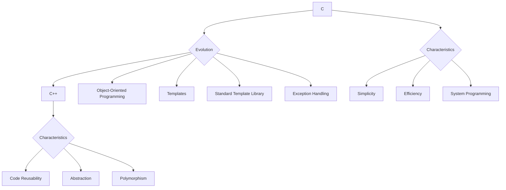

# Cpp_for_babies
Learning C++ from scratch 

```mermaid
flowchart TD
    A[C] --> B{Evolution}
    B --> C[C++]
    B --> D[Object-Oriented Programming]
    B --> E[Templates]
    B --> F[Standard Template Library]
    B --> G[Exception Handling]
    
    A --> H{Characteristics}
    H --> I[Simplicity]
    H --> J[Efficiency]
    H --> K[System Programming]
    
    C --> L{Characteristics}
    L --> M[Code Reusability]
    L --> N[Abstraction]
    L --> O[Polymorphism]
```
